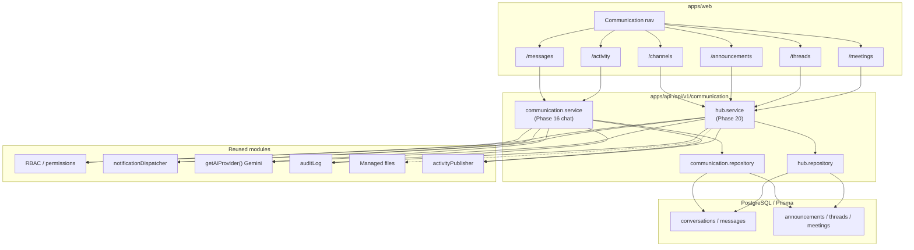
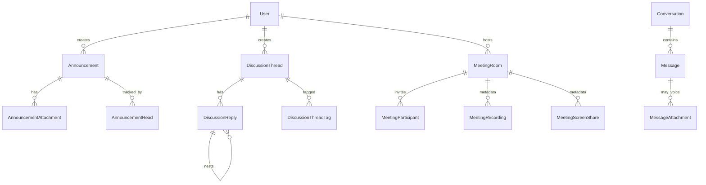
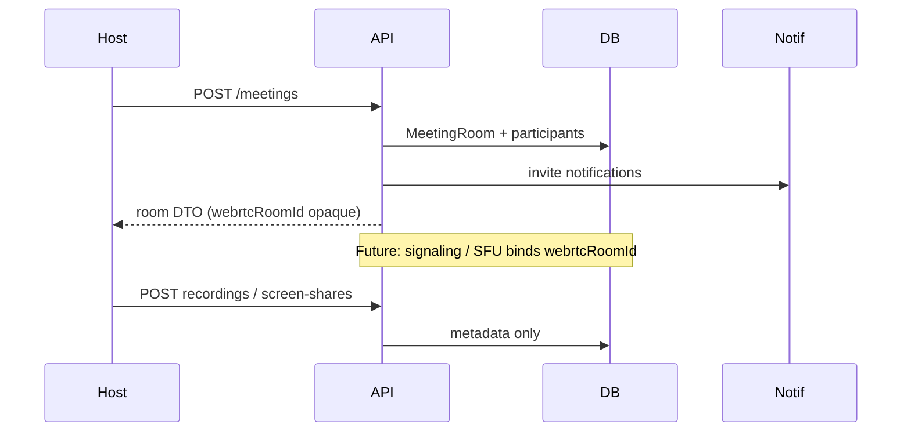

# Phase 20 — Enterprise Communication Hub Architecture

**Status:** Delivered (architecture-only for WebRTC)  
**Depends on:** Phases 1–19 (Auth, RBAC, Users, Teams, AI/Gemini, Integrations, Notifications, Security, Activity, Files, Calendar, Billing, Reports, Settings, Phase 16 Chat)

---

## System context



---

## Layering (unchanged enterprise pattern)

```
Routes → validate(Zod) → authorize(RBAC) → Controller → Service → Repository → Prisma
                              ↓
                    audit + activity + notifications (+ AI when requested)
```

Shared Zod schemas live in `@enterprise/shared` (`communication.schema.ts`, `communication-hub.schema.ts`). API `*.validation.ts` re-exports only.

---

## Domain model (Phase 20 additions)



**Reuse (not duplicated):** `User`, org settings, `Team`/`Department` IDs as optional FKs/fields, `ManagedFile` IDs on attachments, `Notification*` via dispatcher, `AuditLog`, `Activity`.

---

## Internal chat (extended)

| Concern | Implementation |
|---------|----------------|
| DMs / groups / team / org channels | `ConversationType` including `ORGANIZATION` |
| Mentions / receipts / typing / reactions / pins / search | Phase 16 paths |
| Attachments | `MessageAttachment` (+ optional `managedFileId`) |
| Voice notes | `MessageKind.VOICE` + `durationSeconds` / `waveformJson` (client playback later) |

Channels UI lists `TEAM` | `DEPARTMENT` | `ORGANIZATION` | `GROUP` and deep-links to Messages.

---

## Meeting architecture (no WebRTC yet)



Waiting room is **status workflow** (`WAITING` → `ADMITTED` → `JOINED`), not a media gate.

---

## Notification bridge

All hub events call existing `notificationDispatcher.notify()`:

| Event | Typical category |
|-------|------------------|
| Chat / mention / thread | `TEAM` |
| Announcement | `SYSTEM` / `TEAM` |
| Meeting invite | `CALENDAR` |

No parallel notification store.

---

## AI bridge

```
POST /communication/ai
  → authorize ai:use
  → hub.service.runAi
  → getAiProvider().generate({ mode, prompt })
```

Actions: summarize conversation, meeting summary, action items, translate, follow-up task suggestions. Does **not** instantiate Gemini directly or duplicate `ai.service`.

---

## Permissions map

| Surface | Read | Write / manage |
|---------|------|----------------|
| Messages / channels | `communication:read` ∨ `chat:read` | `communication:write` ∨ `chat:write` |
| Announcements mutate | — | `announcement:manage` |
| Threads resolve/moderate | — | `thread:manage` |
| Meetings mutate | — | `meeting:manage` |
| Hub AI | — | `ai:use` |

---

## Frontend routes

| Path | Feature |
|------|---------|
| `/messages` | Existing chat UI |
| `/channels` | Channel list |
| `/announcements` | Announcement Center |
| `/threads` | Discussion Threads |
| `/meetings` | Meeting rooms (architecture UI) |
| `/activity` | Activity feed (includes hub entities) |

---

## Future (not Phase 20)

- WebRTC / SFU signaling using `MeetingRoom.webrtcRoomId`
- Real-time push (WebSocket) instead of presence polling
- Voice recorder UI wired to `VOICE` kind
- Phase 21+ modules
