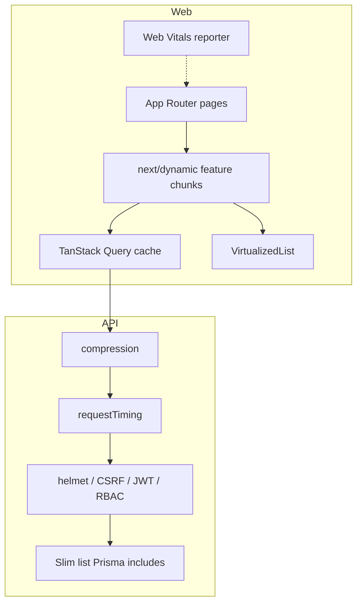

# Phase 20 — Performance Optimization Architecture

**Status:** Delivered  
**Plan label:** PROJECT_PLAN Phase 20 — Performance  
**Docs label:** `PHASE20_PERFORMANCE_*` (Communication Hub remains `PHASE20_*`)

---

## Layers



---

## Frontend

| Technique | Implementation |
|-----------|----------------|
| Route code splitting | `lazy-feature-pages.tsx` + dashboard route pages |
| Component lazy load | Existing dashboard/settings/integrations dynamics retained |
| Suspense / loading | Dynamic `loading` fallbacks + route `loading.tsx` |
| Error boundaries | `FeatureErrorBoundary` wrapping lazy pages |
| Debounced search | `useDebouncedValue(300)` on CRM / files / team |
| Virtual lists | CRM mobile cards via `@tanstack/react-virtual` |
| Query cache | staleTime 60s, gcTime 15m, no focus refetch, reconnect on |
| Images | `next/image` wrapper + AVIF/WebP + remotePatterns |
| Fonts | `next/font` Inter / JetBrains with `display: swap` |
| Tree shaking | `experimental.optimizePackageImports` for lucide / framer |
| Prefetch | `PrefetchLink` / `useRoutePrefetch` |
| Bundle analysis | `npm run analyze` flag hook (`ANALYZE=true`) |

---

## API

| Technique | Implementation |
|-----------|----------------|
| Compression | `compression()` middleware |
| Slow query / request detection | `[perf] slow_request` logs when ≥ `SLOW_REQUEST_MS` (default 500) |
| Efficient list payloads | Projects: no milestones/attachments on list; Invoices: no line items on list; Tasks: attachments via `_count` only on list; Messages list: selected read fields |

Detail endpoints remain rich — UI detail drawers still hydrate full graphs.

---

## Database / Prisma

### List vs detail includes
- **Projects list:** client + capped members (12)  
- **Invoices list:** client + project only  
- **Tasks list:** project + assignee + comment/attachment counts  
- **Messages list:** lighter reaction user select + explicit read selects  

### Index recommendations (apply in a future migration if missing)

```sql
-- Suggested composites for hot list filters (verify with EXPLAIN before applying)
-- CREATE INDEX CONCURRENTLY IF NOT EXISTS "Project_deletedAt_status_idx" ON "Project" ("deletedAt", "status");
-- CREATE INDEX CONCURRENTLY IF NOT EXISTS "Task_deletedAt_status_dueDate_idx" ON "Task" ("deletedAt", "status", "dueDate");
-- CREATE INDEX CONCURRENTLY IF NOT EXISTS "Invoice_deletedAt_status_issueDate_idx" ON "Invoice" ("deletedAt", "status", "issueDate");
-- CREATE INDEX CONCURRENTLY IF NOT EXISTS "Message_conversationId_createdAt_idx" ON "Message" ("conversationId", "createdAt");
```

N+1: list endpoints avoid nested `items`/`milestones`/`attachments` collections.

---

## Cache strategy (TanStack Query)

| Setting | Value | Rationale |
|---------|-------|-----------|
| `staleTime` | 60s | Avoid thrashing on tab switches within a minute |
| `gcTime` | 15m | Keep back-navigation warm |
| `refetchOnWindowFocus` | false | Enterprise desks switch apps often |
| `refetchOnReconnect` | true | Recover after offline |
| Deduping | QueryClient default | Identical in-flight keys share one network call |
| Invalidation | Existing mutation hooks | Unchanged contracts |

Polling features (chat/notifications) keep their own `refetchInterval` / shorter `staleTime`.

---

## Security (unchanged)

Helmet, CORS credentials, CSRF, JWT, RBAC, rate limiting, reCAPTCHA remain ahead of / around the new compression + timing middleware. Timing logs never include tokens or bodies.

---

## Out of scope

- Responsive redesign  
- Deployment / CI (later plan phases)  
- Changing authenticated Cache-Control for JSON (rely on client cache)  
