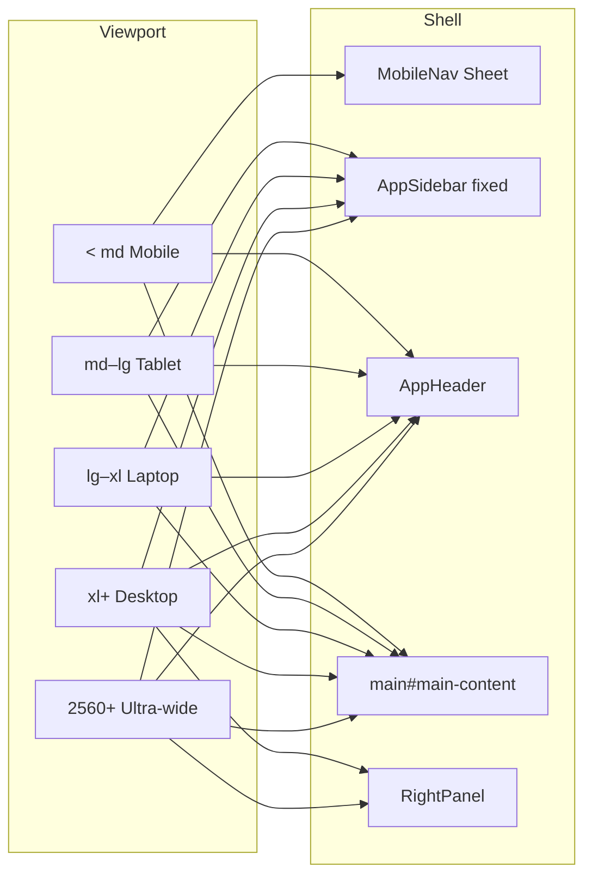

# Phase 21 — Enterprise Responsive Design Architecture

**Status:** Delivered  
**Depends on:** Phases 1–20 (design system, shell, feature modules, Communication Hub)  
**Constraint:** Layout/CSS/component adaptation only — no redesign, no API/RBAC changes, no Phase 22

---

## Goals

1. Make every authenticated shell surface usable from **mobile small → ultra-wide (2560px+)**.
2. Keep EliteFlow visual language, routing, and RBAC intact.
3. Centralize breakpoint tokens and reusable responsive patterns so features do not invent one-off hacks.

---

## Breakpoint model

Aligned with design system §2.9 and Tailwind defaults:

| Token | px | Role |
|-------|-----|------|
| `sm` | 640 | Large mobile |
| `md` | 768 | Tablet portrait — fixed sidebar begins |
| `lg` | 1024 | Tablet landscape / laptop |
| `xl` | 1280 | Desktop — right utility panel |
| `2xl` | 1536 | Large desktop |
| `uw` | 2560 | Ultra-wide padding / max content |

**Source of truth**

- Constants / media queries: `apps/web/src/lib/breakpoints.ts`
- React hook: `apps/web/src/hooks/use-breakpoint.ts` (built on `useMediaQuery`)
- CSS tokens: `--breakpoint-*` in `apps/web/src/app/globals.css` `@theme inline`

---

## Shell architecture



| Layer | Behavior |
|-------|----------|
| **Sidebar** | Hidden below `md`. Fixed + collapsible from `md+`. Width 72px collapsed / 240–280px expanded. Collapse persisted in Zustand (`eliteflow-ui`). |
| **Mobile nav** | Hamburger + left Sheet below `md`. Includes AI + quick create shortcuts. |
| **Navbar** | Search (inline `md+`, sheet below), AI Assistant, Quick Actions, notifications, theme, profile. |
| **Right panel** | `xl+` only; state persisted. Dashboards duplicate panel content under `xl:hidden` where needed. |
| **Main** | Responsive padding; `overflow-x-hidden`; ultra-wide extra horizontal padding. |
| **Skip link** | First focusable control in `DashboardShell`. |

---

## Data display pattern

```
ResponsiveDataView
├── table  → hidden below breakpoint (default md)
└── cards  → visible below breakpoint
```

Used by:

- Clients / Projects / Tasks / Invoices tables  
- Sticky headers via `.table-sticky-header`  
- Sorting / filters / pagination remain owned by parent feature pages (unchanged contracts)

---

## Overlays

| Primitive | Mobile | Tablet+ |
|-----------|--------|---------|
| `Dialog` | Full viewport (`h-dvh`, no radius) | Centered `max-w-lg` modal |
| `Sheet` | Fluid width (`min(100vw, …)`) | Fixed 280–320px rails |
| Dropdowns | Unchanged Radix positioning | Unchanged |

---

## Forms & settings

- Settings section nav: `<select>` below `lg`; button list `lg+`.
- Settings field grids: single column until `lg` (`lg:grid-cols-2` / `lg:grid-cols-3`).
- Page CTAs: full-width on mobile (`PageHeader`).

---

## Performance & motion

| Technique | Where |
|-----------|--------|
| Existing `next/dynamic` | Dashboards, settings sections, integrations, right panel |
| `content-visibility: auto` | `.content-auto` on chart cards |
| Shorter Framer durations | `lib/motion.ts` |
| `prefers-reduced-motion` | Hard-disable in `globals.css` |
| Mobile animation budget | Shorter open/close hints under 768px |
| Images / SVG | `max-width: 100%` base rule |

Virtual lists remain as introduced in Communication (Phase 20) — not reimplemented here.

---

## Accessibility

- Skip to main content  
- `aria-expanded` / `aria-controls` on mobile nav & sidebar collapse  
- Focus-visible rings (global)  
- Touch targets ≥ 44px via `.touch-target` / `.touch-target-auto` on coarse pointers  
- `prefers-contrast: more` border/ring boosts  
- Screen-reader titles on sheets (`SheetTitle` / `sr-only`)

---

## File inventory (Phase 21)

### New

- `apps/web/src/lib/breakpoints.ts`
- `apps/web/src/hooks/use-breakpoint.ts`
- `apps/web/src/components/layout/page-container.tsx`
- `apps/web/src/components/layout/header-quick-actions.tsx`
- `apps/web/src/components/common/data/responsive-data-view.tsx`
- `apps/web/src/components/common/data/index.ts`
- `docs/PHASE21_REPORT.md`
- `docs/PHASE21_ARCHITECTURE.md`
- `docs/PHASE21_TESTING_CHECKLIST.md`

### Updated (representative)

- Shell: `dashboard-shell`, `app-sidebar`, `mobile-nav`, `app-header`, `search-bar`, `page-header`
- UI: `dialog`, `sheet`, `card`, `globals.css`, `motion.ts`, `use-media-query.ts`
- Tables: clients / projects / tasks / invoices
- Settings: center + sections grids
- Dashboard role views + KPI grid + charts wrapper
- Calendar layout grid

---

## Out of scope

- Deployment / CI / env (Phase 22)  
- New design tokens beyond breakpoint documentation  
- Changing Communication Hub dual-pane logic (already responsive)  
- Backend / Prisma / permissions
